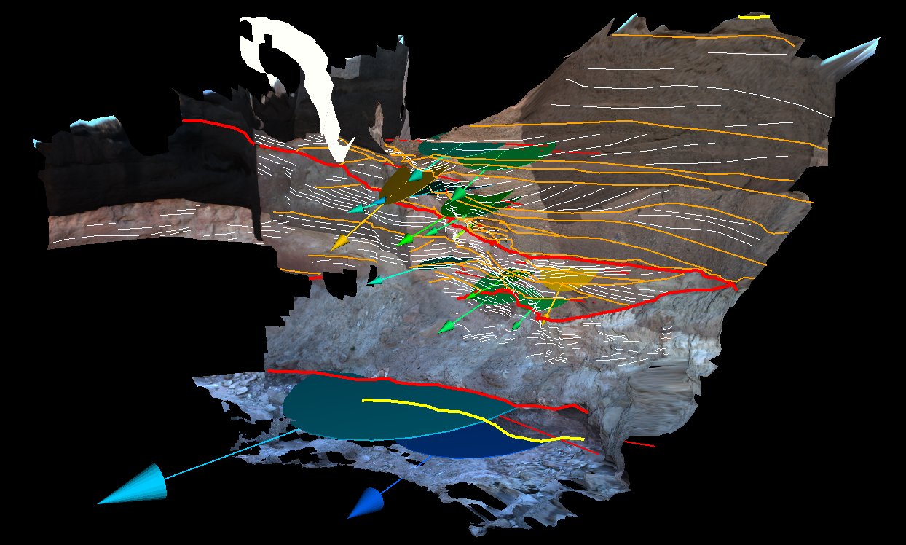
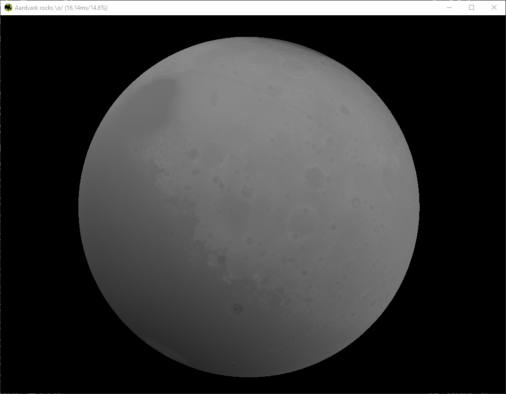

This repository aims providing 3D Stereo Support for the [PRo3D ecosystem](https://pro3d.space/) in particular [PRo3D](https://github.com/pro3d-space/PRo3D).
Currently, the repository only contains a stereographic 3D Viewer for the Ordered Point Cloud Format (OPC) based on 
the [aardvark-platform](https://aardvarkians.com/) which could serve as a basis for further development leveraging 3D data on 3D hardware.

Rendering works on PRO graphics with quad-buffer stereo, tested on [PluraView](https://www.3d-pluraview.com/de/)

